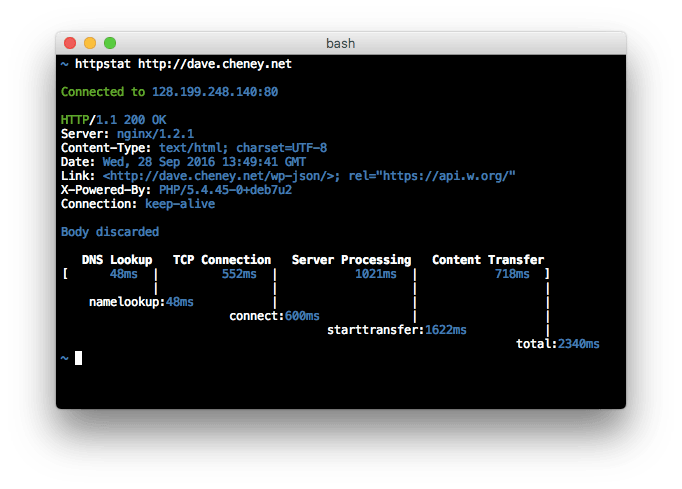

# httpstat

Imitation is the sincerest form of flattery.

But seriously, https://github.com/reorx/httpstat is the new hotness, and this is a shameless rip off.

## Installation

	$ go get -u github.com/davecheney/httpstat

## We don't need no stinking curl

`httpstat.py` is a wrapper around `curl(1)`, which is all fine and good, but what if you don't have `curl(1)` or `python(1)` installed?

## TODO

The big ticket features which are missing at this point are:

- support for https; this involves negotating the handshake before sending the request, adjusting the various timing points, and using the alternative template.
- ~~detect when `httpstat` is being piped to a file or other not tty device and disable coloured output.~~ done, thanks @amy
- support for more CURL flags, like `-H HEADER` and `-X METHOD`.
- spool response.Body to a temporary file.
- Sort response headers inteligently, #18

## Contributing

Bug reports and feature requests are welcome.

Pull requests are most welcome, but if the feature is not on the TODO list, please open an issue to discuss the feature before slinging code. Thank you.
