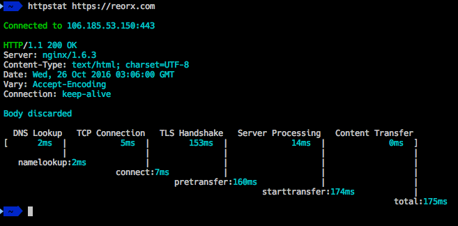

# httpstat

[](https://travis-ci.org/davecheney/httpstat)



Imitation is the sincerest form of flattery.

But seriously, https://github.com/reorx/httpstat is the new hotness, and this is a shameless rip off.

## Installation
`httpstat` requires Go 1.7.1 or later.
```
$ go get -u github.com/davecheney/httpstat
```	
## Usage
```
$ httpstat https://example.com/
```
## Features

- Windows/BSD/Linux supported.
- HTTP and HTTPS are supported, for self signed certificates use `-k`.
- Skip timing the body of a response with `-I`.
- Follow 30x redirects with `-L`.
- Change HTTP method with `-X METHOD`.
- Provide a `PUT` or `POST` request body with `-d string`. To supply the `PUT` or `POST` body as a file, use `-d @filename`.
- Add extra request headers with `-H 'Name: value'`.
- The response body is usually discarded, you can use `-o filename` to save it to a file, or `-O` to save it to the file name suggested by the server.
- HTTP/HTTPS proxies supported via the usual `HTTP_PROXY`/`HTTPS_PROXY` env vars (as well as lower case variants).

## TODO

This project is aiming for a 1.0 release on the 3rd of October. Open issues for this release are tagged with [this milestone](https://github.com/davecheney/httpstat/milestone/1).

Any open issue not tagged for the [stable release milestone](https://github.com/davecheney/httpstat/milestone/1) will be addressed after the 1.0 release.

## Contributing

Bug reports and feature requests are welcome.

Pull requests are most welcome but must include a `fixes #NNN` or `updates #NNN` comment. 

Please discuss your design on the accompanying issue before submitting a pull request. If there is no suitable issue, please open one to discuss the feature before slinging code. Thank you.
